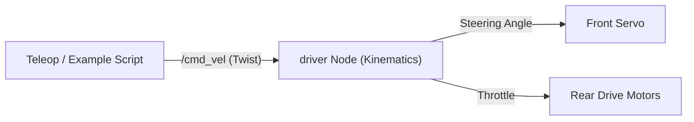
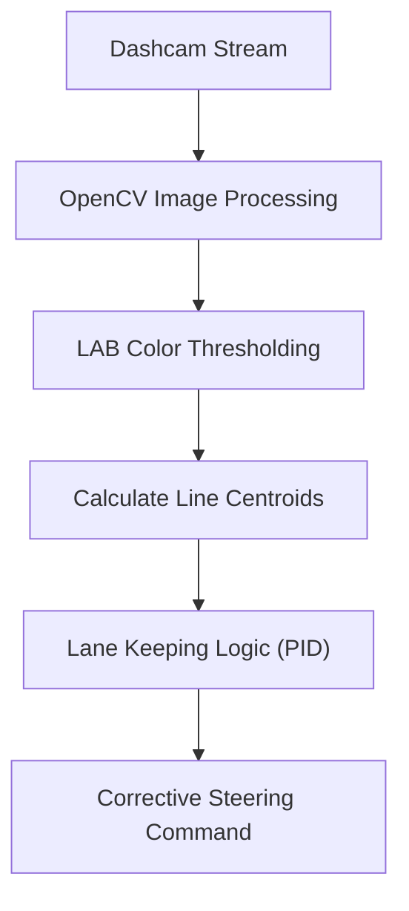
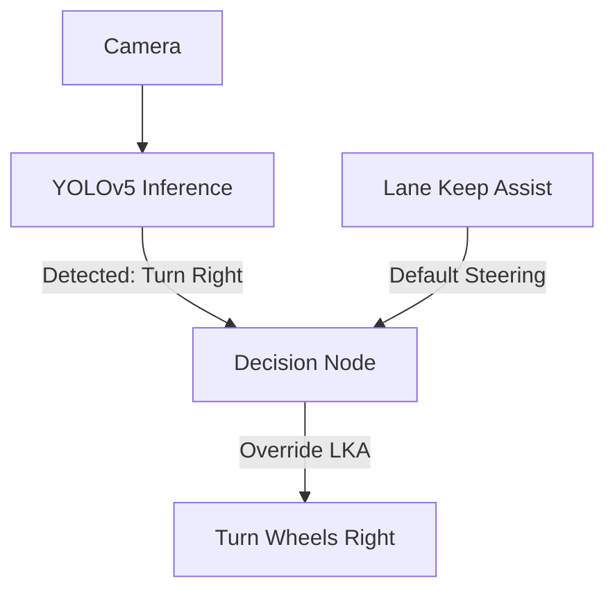
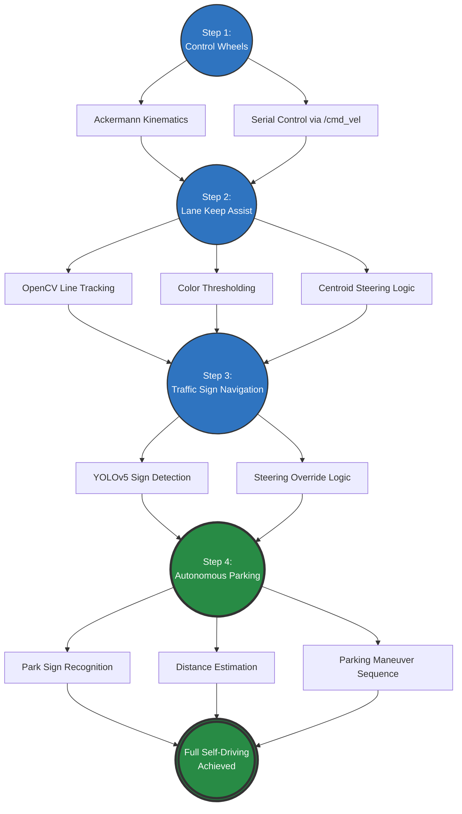
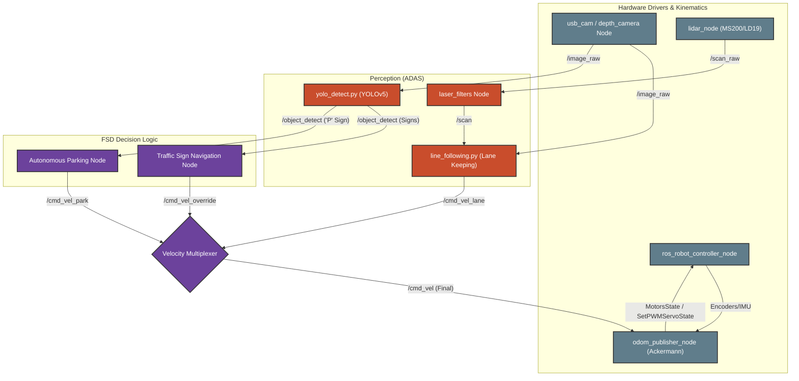

# MentorPi M1 robot Mastering Path: Full Self-Driving (FSD) Engineering

Welcome to the MentorPi M1 robot FSD engineering track. This specialized learning path discards general robotics concepts to focus strictly on building a **Full Self-Driving (FSD) Autonomous Vehicle**. You will learn to integrate Ackermann steering, computer vision for lane keeping, and AI for traffic recognition.

---

## 🟢 Step 1: Control Wheels
**Objective:** The "Hello World" of autonomous vehicles—establishing communication with the hardware and getting the drive motors to turn.

### 1.1 Hardware Architecture & Boot
*   **Main Controller:** STM32 handles real-time throttle and steering servo control.
*   **High-Level Compute:** Raspberry Pi / Jetson Nano running ROS 2.
*   **Initialization:** Master the `bringup.launch.py` sequence to bring the vehicle online and establish serial communication.

### 1.2 Drive-by-Wire & Kinematics
*   **Configuration:** Ensure the `MACHINE_TYPE` environment variable is set to `MentorPi_Acker` (Car-like steering) before launching.
*   **Motor Control:** Understand how `src/driver/controller/controller/odom_publisher_node.py` converts `/cmd_vel` (Twist) messages into specific steering angles for the front servo (`SetPWMServoState`) and throttle speeds for rear motors (`MotorsState`).

### 1.3 Actionable ROS 2 Steps
1.  **Start the base system (Drivers & Sensors):**
    ```bash
    ros2 launch bringup bringup.launch.py
    ```
2.  **Test Manual Control (Teleop):**
    ```bash
    ros2 launch peripherals joystick_control.launch.py
    ```
    *Alternatively, run the example script to publish test velocities directly:*
    ```bash
    ros2 run example body_control
    ```



---

## 🟡 Step 2: Lane Keep Assist (LKA)
**Objective:** Equip the vehicle with "eyes" to understand roads and lane markings, ensuring it stays centered on the track.

### 2.1 Environmental Scanning (Camera Setup)
*   Interface with the front-facing camera via [[peripherals]] (`usb_cam` or `depth_camera`).
*   Understand image topics and basic image filtering.

### 2.2 OpenCV Line Tracking (LKA)
*   **The Code:** Study `src/app/app/line_following.py` to see how camera frames are processed.
*   **Core Logic:**
    1.  Convert camera feeds (`/ascamera/camera_publisher/rgb0/image`) into LAB color space.
    2.  Apply thresholding to isolate the color of the lane markings (e.g., white/yellow lines).
    3.  Calculate the geometric centroid across multiple Regions of Interest (ROIs) to determine the offset.
*   **Steering Correction:** The node publishes corrective steering commands (`/controller/cmd_vel`) proportional to the centroid's offset to keep the vehicle centered.

### 2.3 Actionable ROS 2 Steps
1.  **Ensure Bringup is running:** (Camera must be active).
2.  **Launch the Lane Keeping App:**
    ```bash
    ros2 launch app line_following_node.launch.py
    ```
3.  **Calibrate Colors (If needed):** Use the ColorPicker tool in `src/app/app/common.py` to adjust LAB thresholds for your specific track lighting.



---

## 🟠 Step 3: Traffic Sign Navigation
**Objective:** Integrate AI object detection to allow the vehicle to make routing decisions based on physical traffic signs.

### 3.1 YOLOv5 Traffic Sign Detection
*   **The Code:** Run the `yolo_detect.py` node from the [[yolov5_ros2]] package.
*   **Model:** Ensure you load a `.pt` model trained to recognize traffic signs (e.g., Left Turn, Right Turn, Stop).
*   **Data Output:** The node publishes to `/object_detect` containing the class name, bounding box, and confidence score.

### 3.2 Decision Logic (State Machine)
*   **Integration:** You will need to write a custom control node (e.g., in the `example` package) that subscribes to both the LKA output and the YOLOv5 output.
*   **Execution:** 
    *   *Default State:* Relay the lane-keeping `/cmd_vel` to the motor drivers.
    *   *Event Trigger:* If YOLO detects a "Turn Left" sign with >80% confidence, temporarily override the LKA command with a hard left turn command (`angular.z`) for a set duration before resuming lane keeping.

### 3.3 Actionable ROS 2 Steps
1.  **Launch YOLOv5 Detection:**
    ```bash
    ros2 launch yolov5_ros2 yolov5_ros2.launch.py
    ```
2.  **View Real-time Detections:**
    ```bash
    ros2 topic echo /yolov5_ros2/object_detect
    ```
3.  **Develop the Override Node:** Create a new Python script in `src/example/example/` that listens to `interfaces/msg/ObjectsInfo` and `geometry_msgs/Twist`, and controls the vehicle accordingly.



---

## 🔴 Step 4: Autonomous Parking
**Objective:** The ultimate FSD challenge—recognize a specific parking zone and execute a complex maneuver to park the vehicle safely.

### 4.1 Target Recognition
*   Use YOLOv5 or OpenCV template matching to specifically search for the "P" (Parking) sign.
*   Once detected, calculate the distance to the sign using the bounding box size or depth camera data.

### 4.2 Parking Maneuver Sequence
*   **State 1: Approach.** Slow down the vehicle's forward velocity (`linear.x`) as the bounding box of the "P" sign grows larger.
*   **State 2: Alignment.** Use Ackermann kinematics to steer into the parking spot.
*   **State 3: Stop & Secure.** Once the vehicle is inside the spot (distance threshold reached), publish a zero velocity command to brake. You can also publish to `/ros_robot_controller/set_buzzer` to signal parking is complete.

### 4.3 Actionable ROS 2 Steps
1.  **Launch the required perception nodes** (Camera, YOLO, LKA).
2.  **Run your Capstone Node:** Execute your custom script that acts as the state machine:
    ```bash
    ros2 run example your_fsd_capstone_node
    ```
    *This custom script will serve as the "Velocity Multiplexer" shown in the architecture graph below.*

---

## 📈 FSD Development Roadmap (Goal Progression)
This graph illustrates the milestone-driven progression to achieve Full Self-Driving capabilities in this project.



---

## 🧩 FSD System Architecture (ROS 2 Node Graph)
Below is the detailed node and topic architecture that powers the FSD features of the MentorPi M1 robot.

