# MentorPi M1 robot Mastering Path: Full Self-Driving (FSD) Engineering

Welcome to the MentorPi M1 robot FSD engineering track. This specialized learning path discards general robotics concepts to focus strictly on building a **Full Self-Driving (FSD) Autonomous Vehicle**. You will learn to integrate motion control, sensor fusion, computer vision, and AI.

---

## 🟢 Phase 1: Basic Motion Control
**Objective:** Establishing communication with the hardware and mastering timed and sensor-based movement sequences.

### 1.1 Manual Control (Teleoperation)
Before writing autonomous code, first confirm that the robot, ROS 2 communication, and motor driver are working correctly by controlling the robot manually from the keyboard.

**Required Node Graph:**
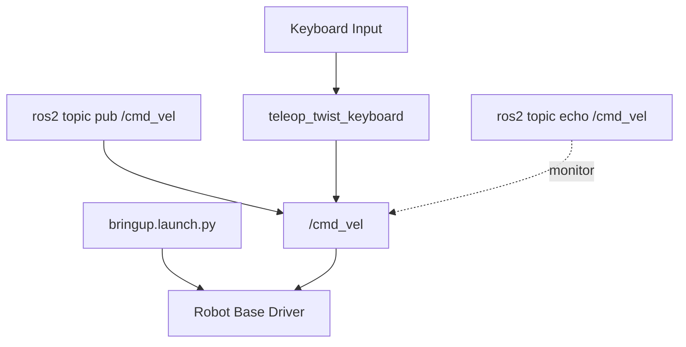

*   **Goal:** Prove that keyboard input can be translated into velocity commands and that the robot responds safely and predictably.
*   **Steps:**
    1. Start the robot base in Terminal 1: `ros2 launch bringup bringup.launch.py`
    2. Start keyboard teleoperation in Terminal 2: `ros2 run teleop_twist_keyboard teleop_twist_keyboard`
    3. (Optional) Monitor outgoing velocity commands in Terminal 3: `ros2 topic echo /cmd_vel`
*   **Direct Command-Line Publishing via `/cmd_vel`:**
    *   You can also send movement commands directly from the terminal without using the keyboard teleop tool:
        ```bash
        ros2 topic pub /cmd_vel geometry_msgs/msg/Twist "{linear: {x: 0.2, y: 0.0, z: 0.0}, angular: {x: 0.0, y: 0.0, z: 0.0}}" --once
        ```
    *   This example publishes one forward-motion command with `linear.x = 0.2`.
    *   To rotate in place, set `linear.x` to `0.0` and change `angular.z`, for example:
        ```bash
        ros2 topic pub /cmd_vel geometry_msgs/msg/Twist "{linear: {x: 0.0, y: 0.0, z: 0.0}, angular: {x: 0.0, y: 0.0, z: 0.5}}" --once
        ```
    *   This method is useful for testing raw topic communication and understanding exactly what data is being sent to the robot.
*   **Keyboard Commands:**
    *   **`i` / `,`**: Move forward / backward by changing `linear.x`
    *   **`j` / `l`**: Turn left / right by changing `angular.z`
    *   **`k`**: Emergency stop by setting all velocities to `0.0`
    *   **`q` / `z`**: Increase / decrease the maximum speed by 10%
*   **What to Observe:**
    *   The robot should move immediately when a command key is pressed.
    *   The `/cmd_vel` topic should display `geometry_msgs/msg/Twist` messages with changing `linear.x` and `angular.z` values.
    *   Pressing `k` should stop the robot completely.
*   **Expected Learning Outcome:** You will understand that teleoperation is simply a publisher that converts keyboard input into `Twist` messages on `/cmd_vel`, which are then consumed by the robot's motion controller.
*   **Why This Matters:** Every later movement node in this learning path will also publish to `/cmd_vel`. If teleoperation works, your software stack, topic routing, and low-level motion interface are already connected correctly.

### 1.2 drive_node.py (The "Hello World" of Movement)
Learn the basics of publishing to the `/cmd_vel` topic from a Python script to make the robot move autonomously. Start by creating your own ROS 2 Python package so the node lives in a clean workspace structure.

**Required Node Graph:**
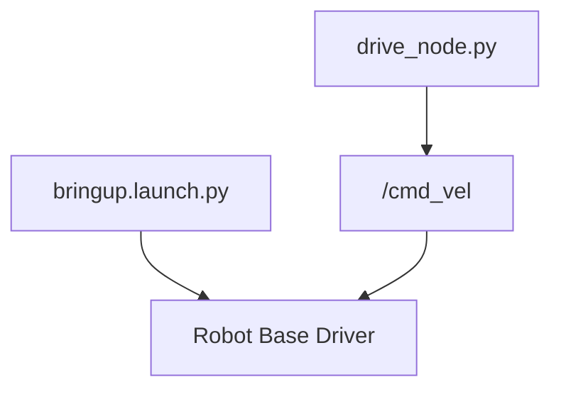

*   **Setup Steps:**
    1. Go to your ROS 2 workspace source directory:
        ```bash
        cd ~/ros2_ws/src
        ```
    2. Create a new Python package:
        ```bash
        ros2 pkg create --build-type ament_python mycar
        ```
    3. Create the node file inside the package:
        ```bash
        cd ~/ros2_ws/src/mycar/mycar
        touch drive_node.py
        ```
    4. Make the node executable:
        ```bash
        chmod +x drive_node.py
        ```
*   **File Locations to Copy Into:**
    *   **Node file:** `~/ros2_ws/src/mycar/mycar/drive_node.py`
    *   **Package configuration:** `~/ros2_ws/src/mycar/setup.py`
*   **Add this line inside `entry_points['console_scripts']` in `setup.py`:**
    ```python
    'drive_node = mycar.drive_node:main',
    ```
*   **Build and Run:**
    ```bash
    cd ~/ros2_ws
    colcon build --packages-select mycar
    ros2 run mycar drive_node
    ```
*   **What the Node Does:** Continuously publishes a `Twist` message to `/cmd_vel`, usually with a fixed forward speed or a simple turn value.
*   **Key Concept:** `geometry_msgs/Twist` message structure.
*   **Expected Learning Outcome:** You will understand how a ROS 2 Python node publishes motion commands without any sensor feedback.

### 1.3 square_move.py (Timed Sequences)
Build on basic movement by teaching the robot to execute a square using timed forward and turning commands.

**Required Node Graph:**
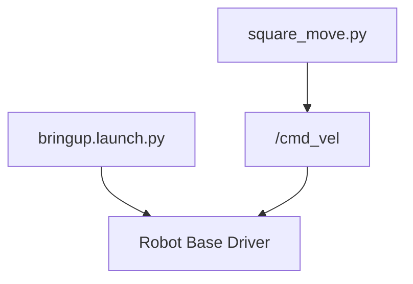

*   **File Locations to Copy Into:**
    *   **Node file:** `~/ros2_ws/src/mycar/mycar/square_move.py`
    *   **Package configuration:** `~/ros2_ws/src/mycar/setup.py`
*   **Add this line inside `entry_points['console_scripts']` in `setup.py`:**
    ```python
    'square_node = mycar.square_move:main',
    ```
*   **Build and Run:**
    ```bash
    cd ~/ros2_ws
    colcon build --packages-select mycar
    ros2 run mycar square_node
    ```
*   **What the Node Does:** Publishes directly to `/cmd_vel`, drives forward for about `2.0` seconds, turns right for about `1.5` seconds, and repeats that cycle four times.
*   **Key Concept:** Open-loop timed motion using `time.time()` and repeated publication.
*   **Expected Learning Outcome:** You will see how a robot can perform a repeatable path without sensors, and also why timed control becomes inaccurate when wheel slip or battery conditions change.

### 1.4 imu_square_move.py (Precision with Sensors)
Move from timed guesses to sensor-based precision by using IMU yaw feedback to maintain heading and complete cleaner 90-degree turns.

**Required Node Graph:**
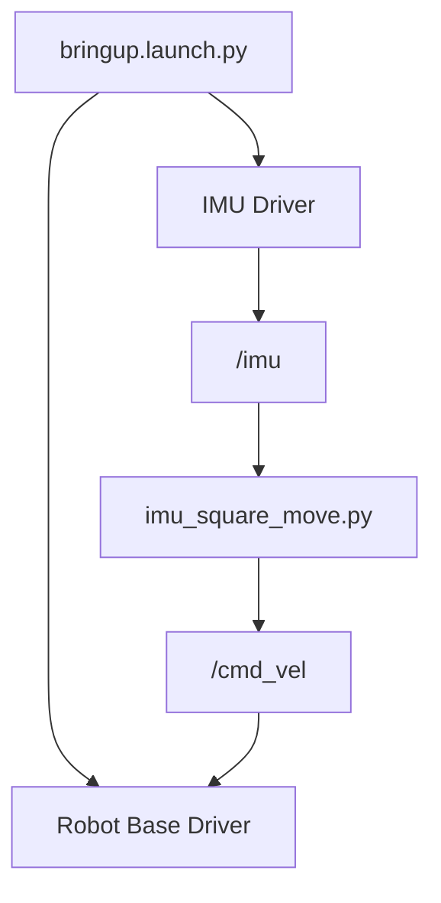

*   **File Locations to Copy Into:**
    *   **Node file:** `~/ros2_ws/src/mycar/mycar/imu_square_move.py`
    *   **Package configuration:** `~/ros2_ws/src/mycar/setup.py`
*   **Add this line inside `entry_points['console_scripts']` in `setup.py`:**
    ```python
    'imu_square_node = mycar.imu_square_move:main',
    ```
*   **Build and Run:**
    ```bash
    cd ~/ros2_ws
    colcon build --packages-select mycar
    ros2 run mycar imu_square_node
    ```
*   **What the Node Does:** Waits for `/imu`, converts quaternion orientation to yaw, drives forward while correcting heading, then turns until the target yaw is reached.
*   **Key Concept:** Quaternion-to-yaw conversion, heading error normalization, and proportional feedback control.
*   **Expected Learning Outcome:** You will understand how sensor feedback makes motion more stable and repeatable than time-only control.

---

## 🟡 Phase 2: Computer Vision Foundations
**Objective:** Equip the vehicle with "eyes" to interact with the environment and stay on the road.

### 2.1 color_control.py (Reaction to Color)
The first step in vision: making movement decisions based on detected colors from the camera.

**Required Node Graph:**
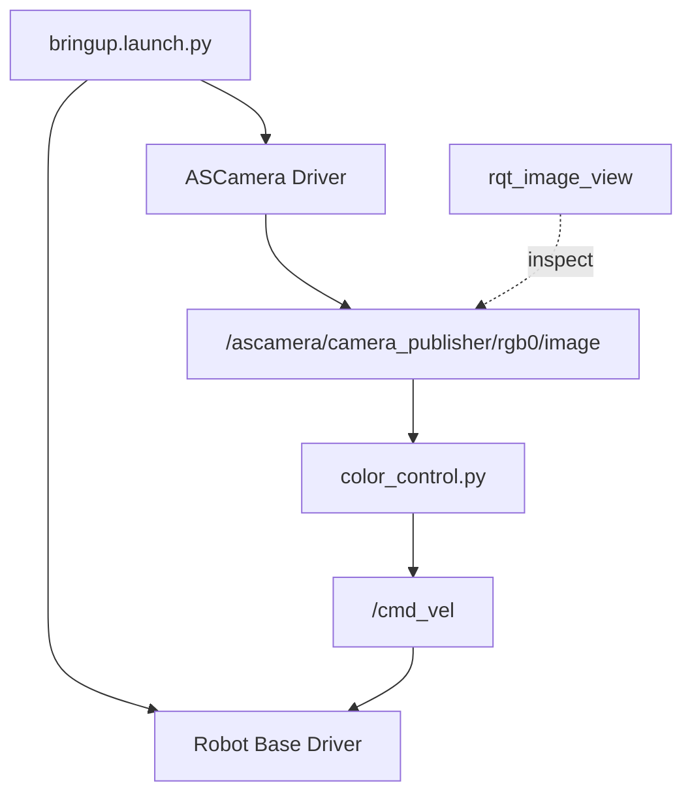

*   **File Locations to Copy Into:**
    *   **Node file:** `~/ros2_ws/src/mycar/mycar/color_control.py`
    *   **Package configuration:** `~/ros2_ws/src/mycar/setup.py`
*   **Add this line inside `entry_points['console_scripts']` in `setup.py`:**
    ```python
    'color_control_node = mycar.color_control:main',
    ```
*   **Build and Run:**
    ```bash
    cd ~/ros2_ws
    colcon build --packages-select mycar
    ros2 run mycar color_control_node
    ```
*   **Optional Image Viewer (`rqt_image_view`):**
    ```bash
    ros2 run rqt_image_view rqt_image_view /ascamera/camera_publisher/rgb0/image
    ```
*   **What the Node Does:** Subscribes to `/ascamera/camera_publisher/rgb0/image`, crops a small center ROI, converts it to HSV, and starts or stops the robot by publishing to `/cmd_vel`.
*   **Behavior:** Green starts forward motion; red stops the robot.
*   **Key Concept:** HSV color analysis and fast ROI-based vision processing.
*   **Expected Learning Outcome:** You will learn how image data can directly trigger robot actions without a full navigation stack.

### 2.2 lane_detect_node.py (Basic Lane Following)
Detect and follow a yellow lane marking using a single Region of Interest at the lower part of the image.

**Required Node Graph:**
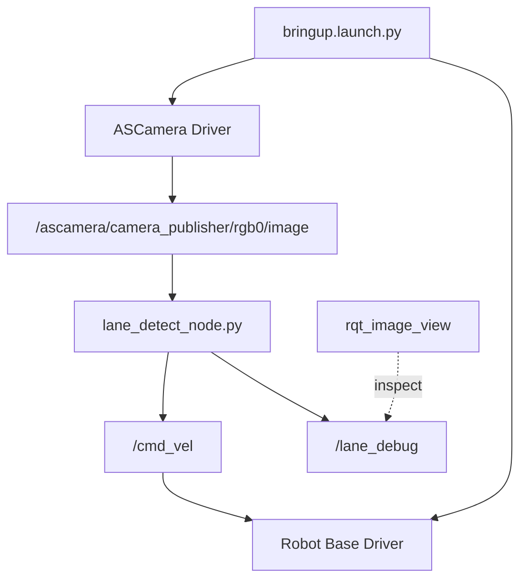

*   **File Locations to Copy Into:**
    *   **Node file:** `~/ros2_ws/src/mycar/mycar/lane_detect_node.py`
    *   **Package configuration:** `~/ros2_ws/src/mycar/setup.py`
*   **Add this line inside `entry_points['console_scripts']` in `setup.py`:**
    ```python
    'lane_detect_node = mycar.lane_detect_node:main',
    ```
*   **Build and Run:**
    ```bash
    cd ~/ros2_ws
    colcon build --packages-select mycar
    ros2 run mycar lane_detect_node
    ```
*   **Optional Image Viewer (`rqt_image_view`):**
    ```bash
    ros2 run rqt_image_view rqt_image_view /lane_debug
    ```
*   **What the Node Does:** Subscribes to the camera image, isolates the lower image region, detects yellow in LAB color space, computes the centroid, and publishes steering corrections to `/cmd_vel`.
*   **Debug Output:** Publishes a visualization image on `/lane_debug`.
*   **Key Concept:** LAB thresholding, contour extraction, image moments, and proportional steering control.
*   **Expected Learning Outcome:** You will understand how lane position becomes a steering error that can be converted into `angular.z`.

### 2.3 lane_keep_node.py (Advanced Multi-ROI Tracking)
Upgrade lane following by using three ROIs so the robot can react to both the current lane position and the upcoming curve.

**Required Node Graph:**
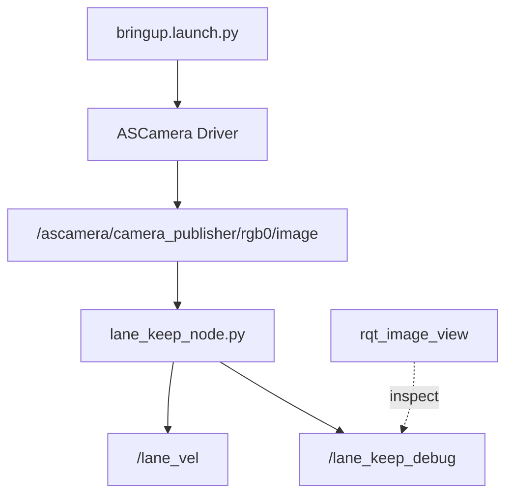

*   **File Locations to Copy Into:**
    *   **Node file:** `~/ros2_ws/src/mycar/mycar/lane_keep_node.py`
    *   **Package configuration:** `~/ros2_ws/src/mycar/setup.py`
*   **Add this line inside `entry_points['console_scripts']` in `setup.py`:**
    ```python
    'lane_keep_node = mycar.lane_keep_node:main',
    ```
*   **Build and Run:**
    ```bash
    cd ~/ros2_ws
    colcon build --packages-select mycar
    ros2 run mycar lane_keep_node
    ```
*   **Optional Image Viewer (`rqt_image_view`):**
    ```bash
    ros2 run rqt_image_view rqt_image_view /lane_keep_debug
    ```
*   **What the Node Does:** Tracks the yellow lane in Near, Mid, and Far ROIs, computes a weighted target point, and publishes the result to `/lane_vel` for later use by a mission manager.
*   **Important Note:** This node is designed for integration and does **not** publish directly to `/cmd_vel`.
*   **Debug Output:** Publishes a visualization image on `/lane_keep_debug`.
*   **Key Concept:** Weighted multi-ROI tracking and look-ahead lane control.
*   **Expected Learning Outcome:** You will see how looking farther ahead produces smoother steering than using only one ROI.

---

## 🟠 Phase 3: Spatial Safety & AI
**Objective:** Implement collision avoidance and interpret complex environmental symbols.

### 3.1 lidar_detect_node.py (Distance Monitoring)
Learn to process 2D LiDAR data to measure the nearest obstacle in front of the robot.

**Required Node Graph:**
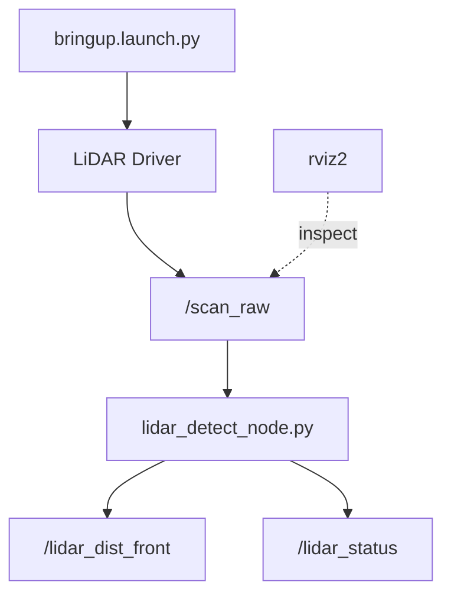

*   **File Locations to Copy Into:**
    *   **Node file:** `~/ros2_ws/src/mycar/mycar/lidar_detect_node.py`
    *   **Package configuration:** `~/ros2_ws/src/mycar/setup.py`
*   **Add this line inside `entry_points['console_scripts']` in `setup.py`:**
    ```python
    'lidar_detect_node = mycar.lidar_detect_node:main',
    ```
*   **Build and Run:**
    ```bash
    cd ~/ros2_ws
    colcon build --packages-select mycar
    ros2 run mycar lidar_detect_node
    ```
*   **Optional LiDAR Viewer (`rviz2`):**
    ```bash
    rviz2
    ```
    Add a **LaserScan** display and set the topic to `/scan_raw`.
*   **What the Node Does:** Subscribes to `/scan_raw`, checks the front sector from about `-30` to `+30` degrees, and publishes the nearest front distance on `/lidar_dist_front` plus a text status on `/lidar_status`.
*   **Status Output:** `CLEAR`, `OBSTACLE_DETECTED`, or `OBSTACLE_NEAR`.
*   **Key Concept:** `sensor_msgs/LaserScan` sector filtering and minimum-distance extraction.
*   **Expected Learning Outcome:** You will understand how raw range data becomes a simple safety status for higher-level decision making.

### 3.2 lidar_avoidance_node.py (Active Dodging)
Move beyond obstacle detection by steering away from nearby objects automatically.

**Required Node Graph:**
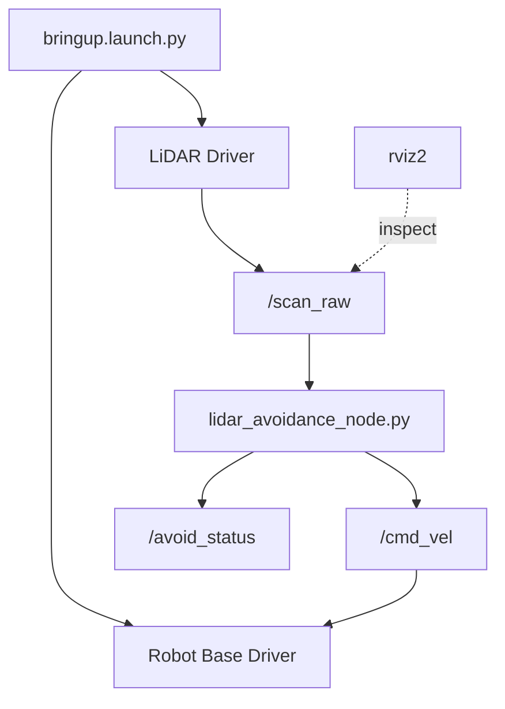

*   **File Locations to Copy Into:**
    *   **Node file:** `~/ros2_ws/src/mycar/mycar/lidar_avoidance_node.py`
    *   **Package configuration:** `~/ros2_ws/src/mycar/setup.py`
*   **Add this line inside `entry_points['console_scripts']` in `setup.py`:**
    ```python
    'lidar_avoidance_node = mycar.lidar_avoidance_node:main',
    ```
*   **Build and Run:**
    ```bash
    cd ~/ros2_ws
    colcon build --packages-select mycar
    ros2 run mycar lidar_avoidance_node
    ```
*   **Optional LiDAR Viewer (`rviz2`):**
    ```bash
    rviz2
    ```
    Add a **LaserScan** display and set the topic to `/scan_raw`.
*   **What the Node Does:** Reads `/scan_raw`, compares left and right obstacle distances, and publishes a direct avoidance command to `/cmd_vel` together with a status message on `/avoid_status`.
*   **Behavior:** If an obstacle is closer on the left, the robot turns right; if it is closer on the right, the robot turns left.
*   **Key Concept:** Reactive obstacle avoidance using directional distance comparison.
*   **Expected Learning Outcome:** You will learn how local sensor data can produce immediate steering decisions without path planning.

### 3.3 yolo_logic_node.py (Traffic Sign Navigation)
Integrate deep learning detections so the robot can change behavior when it sees navigation signs.

**Required Node Graph:**
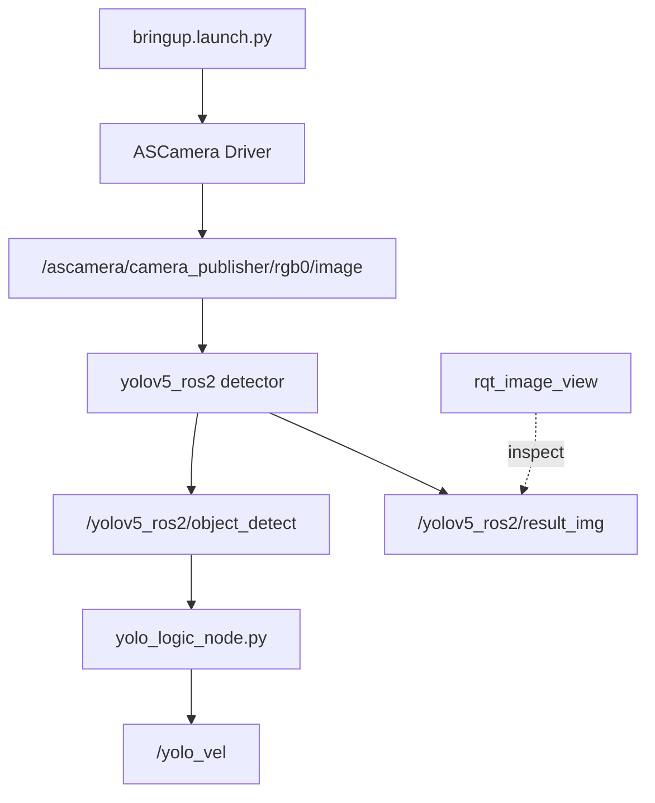

*   **File Locations to Copy Into:**
    *   **Node file:** `~/ros2_ws/src/mycar/mycar/yolo_logic_node.py`
    *   **Package configuration:** `~/ros2_ws/src/mycar/setup.py`
*   **Add this line inside `entry_points['console_scripts']` in `setup.py`:**
    ```python
    'yolo_logic_node = mycar.yolo_logic_node:main',
    ```
*   **Build and Run:**
    ```bash
    cd ~/ros2_ws
    colcon build --packages-select mycar
    ros2 run mycar yolo_logic_node
    ```
*   **Optional Image Viewer (`rqt_image_view`):**
    ```bash
    ros2 run rqt_image_view rqt_image_view /yolov5_ros2/result_img
    ```
*   **What the Node Does:** Subscribes to `/yolov5_ros2/object_detect`, interprets recognized classes, and publishes temporary maneuver commands to `/yolo_vel`.
*   **Behavior Mapping:** `R` or `turn_right` triggers a right turn, `S` or `go_straight` moves forward, and `P`, `parking`, or `stop` triggers a stop behavior.
*   **Important Note:** This node is designed for integration and does **not** publish directly to `/cmd_vel`.
*   **Key Concept:** AI inference integration, confidence filtering, and timed state-machine maneuvers.
*   **Expected Learning Outcome:** You will understand how sign recognition can override default motion behavior for a short, controlled maneuver.

---

## 🔵 Phase 4: Human-Robot Interaction
**Objective:** Control the vehicle using advanced computer vision techniques.

### 4.1 hand_control.py (Gesture Control)
Use MediaPipe hand tracking so the robot responds to finger-count gestures from the camera.

**Required Node Graph:**
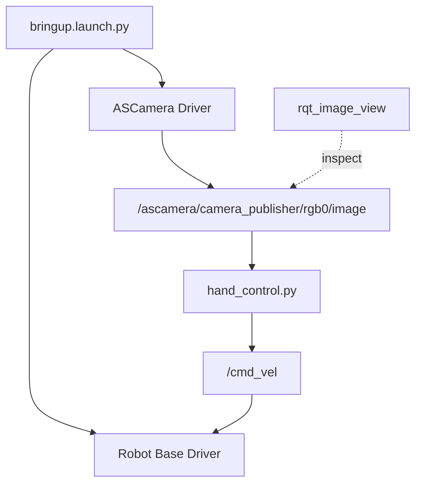

*   **File Locations to Copy Into:**
    *   **Node file:** `~/ros2_ws/src/mycar/mycar/hand_control.py`
    *   **Package configuration:** `~/ros2_ws/src/mycar/setup.py`
*   **Add this line inside `entry_points['console_scripts']` in `setup.py`:**
    ```python
    'hand_control_node = mycar.hand_control:main',
    ```
*   **Build and Run:**
    ```bash
    cd ~/ros2_ws
    colcon build --packages-select mycar
    ros2 run mycar hand_control_node
    ```
*   **Optional Image Viewer (`rqt_image_view`):**
    ```bash
    ros2 run rqt_image_view rqt_image_view /ascamera/camera_publisher/rgb0/image
    ```
*   **What the Node Does:** Subscribes to the camera image, runs MediaPipe Hands, counts raised fingers, and publishes motion commands directly to `/cmd_vel`.
*   **Behavior:** Showing `1` or `2` fingers starts forward motion; showing `5` fingers stops the robot.
*   **Key Concept:** Hand landmark tracking and gesture-to-command mapping.
*   **Expected Learning Outcome:** You will learn how perception-based user interaction can control the robot without a keyboard.

---

## 🏁 Phase 5: The Full Self-Driving (FSD) System
**Objective:** Orchestrate computer vision, IMU, and deep learning into a unified autonomous stack.

The ultimate goal is to launch the complete FSD stack, where multi-ROI lane centering, IMU-based lane searching, and YOLO-based sign logic (Turn Right, Parking) are combined into a single sophisticated control node.

**Required Node Graph:**
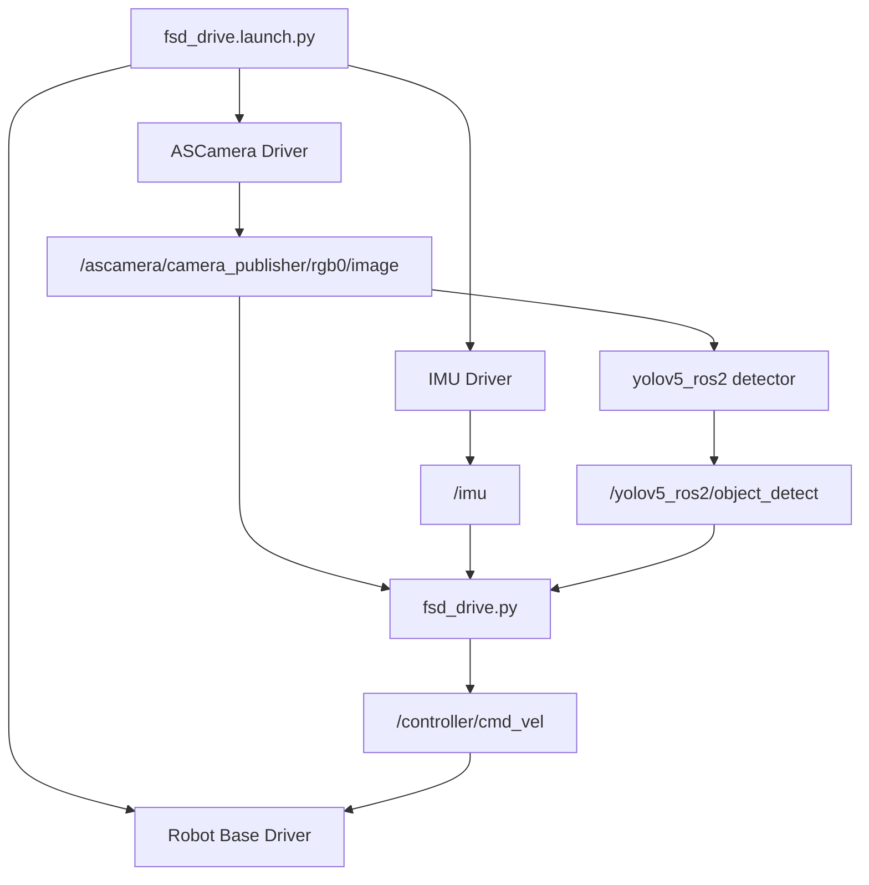

*   **Main Launch File:** `~/ros2_ws/src/mycar/launch/fsd_drive.launch.py`
*   **Core File in This Phase:**
    *   `~/ros2_ws/src/mycar/mycar/fsd_drive.py`
*   **Launched Nodes and Topics:**
    *   `fsd_drive` subscribes to `/ascamera/camera_publisher/rgb0/image`, `/imu`, and `/yolov5_ros2/object_detect`.
    *   `fsd_drive` internally manages the state machine (lane tracking, IMU search, and YOLO maneuvers) and publishes directly to `/controller/cmd_vel`.
    *   `yolo_detect` processes the image and identifies signs (go, right, park).
*   **Behavior Rule:** YOLO maneuver overrides lane keeping. If the lane is lost, an IMU-based 30-degree search is triggered to find it again.
*   **Build and Run:**
    ```bash
    cd ~/ros2_ws
    colcon build --packages-select mycar
    ros2 launch mycar fsd_drive.launch.py
    ```
*   **Expected Learning Outcome:** You will understand how a unified state-machine can seamlessly switch between perception-based lane centering, IMU search patterns, and AI-driven maneuvers to form a complete autonomous driving loop.
