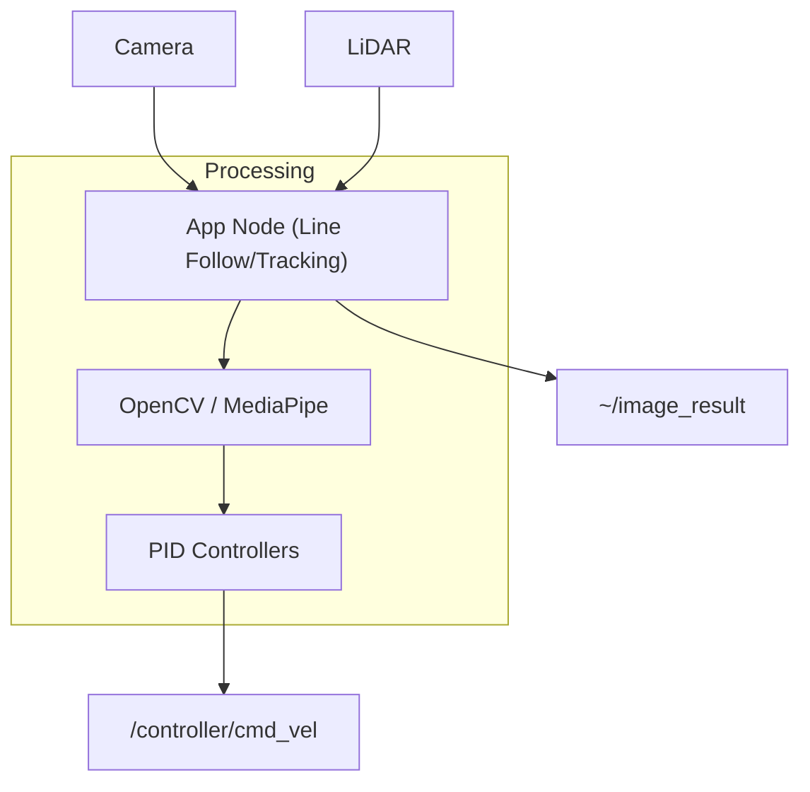

# System Overview - App Package

The `app` package is the "brain" of the MentorPi M1 robot robot, containing high-level robotics applications that integrate computer vision, LiDAR processing, and interactive behaviors.

## Core Applications

### 1. Line Following (`line_following.py`)
Uses the camera to detect and follow a path (usually a line on the floor).
- **Core Logic:** Uses OpenCV to convert frames to LAB color space, applies Gaussian blurring and color thresholding (In-Range) to isolate the line. It calculates the centroid of the line across multiple Regions of Interest (ROIs) to determine the steering angle.
- **Subscribed Topics:**
    - `/ascamera/camera_publisher/rgb0/image` (sensor_msgs/Image): Raw camera feed.
    - `/vocal_detect/wakeup` (std_msgs/Bool): Voice-activated start.
- **Published Topics:**
    - `/controller/cmd_vel` (geometry_msgs/Twist): Velocity commands for tracking.
    - `~/image_result` (sensor_msgs/Image): Visual feedback with detected line overlay.
- **Services:**
    - `~/set_running` (interfaces/srv/SetBool): Start/stop the application.

### 2. Object Tracking (`object_tracking.py`)
Tracks and follows colored objects (e.g., a red ball).
- **Core Logic:** Similar to line following but uses a single large ROI and PID controllers for both linear (distance) and angular (direction) movement. It uses the area of the detected contour to estimate distance.
- **Key Parameters:** PID gains for linear and angular controllers, target color (LAB).

### 3. Hand Gesture Recognition (`hand_gesture.py`)
Control the robot using hand movements.
- **Core Logic:** Uses MediaPipe for hand landmark detection. It recognizes specific gestures (e.g., "palm" to stop, "fist" to move) or tracks the hand's 3D position to map to robot movement.
- **Services:** Supports `~/enter`, `~/exit`, and `~/set_running`.

### 4. AR Application (`ar_app.py`)
Project virtual 3D models onto the camera feed.
- **Core Logic:** Uses `obj_loader.py` to parse `.obj` files and renders them onto the video stream using OpenCV or OpenGL-based transformations. It can anchor models to detected markers or specific ground planes.
- **Service:** `~/set_model` (large_models_msgs/srv/SetString) to switch between models (bicycle, fox, etc.).

### 5. LiDAR Controller (`lidar_controller.py`)
Implements behaviors based on 2D LiDAR data.
- **Obstacle Avoidance:** Scans sectors in front of the robot and adjusts `cmd_vel` to steer away from obstacles.
- **Lidar Following:** Uses the nearest cluster of points to track a moving object (like a person's legs).
- **Lidar Guarding:** Monitors a specific zone and triggers an alarm (buzzer/LEDs) or rotates the robot if an intrusion is detected.
- **Subscribed Topics:** `/scan_raw` (sensor_msgs/LaserScan).

## Shared Utilities (`common.py`)
- **Heartbeat:** A safety mechanism. If the application node crashes or stops sending a heartbeat, the controller can trigger an emergency stop.
- **ColorPicker:** A UI utility for real-time calibration of LAB color thresholds.

## Directory Structure
- `app/`: Python nodes and logic.
- `launch/`: Launch files (e.g., `start_app.launch.py`).
- `models/`: 3D assets for AR.
- `resource/`: Package metadata.

## System Architecture

