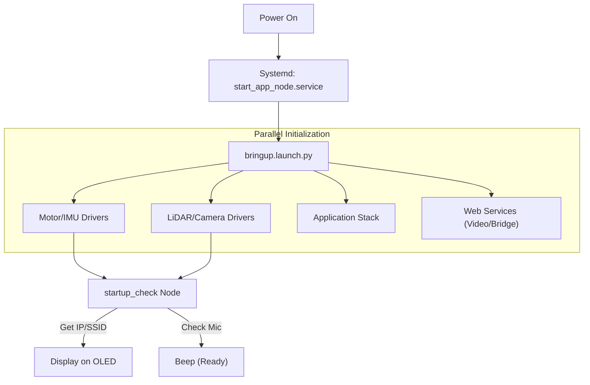

# System Overview - Bringup Package

The `bringup` package is the master orchestrator of the MentorPi M1 robot, responsible for system startup, hardware health checks, and service integration.

## Core Processes

### 1. Master Launch (`bringup.launch.py`)
This is the single command that starts the entire robot. It includes:
- **`controller.launch.py`**: Motor drivers and kinematics.
- **`lidar.launch.py`**: LiDAR sensor driver.
- **`depth_camera.launch.py`**: Camera driver.
- **`start_app.launch.py`**: High-level application nodes.
- **`rosbridge_websocket`**: Interface for web-based control.
- **`web_video_server`**: HTTP stream for camera feeds.

### 2. Startup Health Check (`startup_check.py`)
Runs automatically on boot to provide visual and auditory feedback.
- **SSID Generation:** Uses the CPU serial number to set a unique Wi-Fi SSID (e.g., `HW-12345678`).
- **OLED Update:** Displays the robot's current IP address and SSID on the onboard screen.
- **Hardware Audit:** Checks for the presence of the Ring Microphone and other peripherals.
- **Readiness Signal:** Beeps the buzzer once all core nodes have finished initializing.

### 3. System Services (`scripts/`)
- **`start_app_node.service`**: A systemd service that ensures the robot launches on power-up.
- **`expand_rootfs.service`**: Automatically expands the Linux filesystem to fill the SD card.
- **Desktop Shortcuts (`.desktop`)**: Icons on the robot's desktop to quickly switch between SLAM and Navigation modes.

## Startup Workflow

## Troubleshooting
- **Buzzer doesn't beep:** Check if the hardware driver is failing to connect (usually a serial port issue).
- **No IP on OLED:** Ensure the Wi-Fi credentials are correct in `wpa_supplicant.conf`.
- **Service Status:** Check logs using `journalctl -u start_app_node.service -f`.
