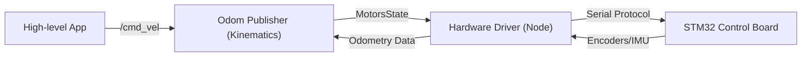

# System Overview - Driver Package

The `driver` meta-package is the low-level foundation of the MentorPi M1 robot, handling serial communication with the STM32 board and performing kinematics for different chassis types.

## Components

### 1. Hardware Driver (`ros_robot_controller`)
The main interface to the physical robot.
- **Node:** `ros_robot_controller_node.py`
- **Serial Interface:** Uses `ros_robot_controller_sdk.py` to communicate with the STM32 board over `/dev/ttyACM0`.
- **Published Topics:**
    - `~/imu_raw` (sensor_msgs/Imu): Raw accelerometer and gyroscope data.
    - `~/battery` (std_msgs/UInt16): Battery voltage in millivolts.
    - `~/button` (ros_robot_controller_msgs/ButtonState): Physical button events on the robot.
    - `~/joy` (sensor_msgs/Joy): Data from the connected gamepad/joystick.
- **Subscribed Topics:**
    - `~/set_motor` (ros_robot_controller_msgs/MotorsState): Set individual motor speeds (RPS).
    - `~/set_led` (ros_robot_controller_msgs/LedState): Control onboard status LEDs.
    - `~/set_buzzer` (ros_robot_controller_msgs/BuzzerState): Control the buzzer (frequency/duration).
    - `~/set_oled` (ros_robot_controller_msgs/OLEDState): Display text on the onboard OLED screen.
    - `~/bus_servo/set_position` (ros_robot_controller_msgs/ServosPosition): Control smart serial servos.

### 2. Kinematics & Odometry (`controller`)
Calculates how the robot moves based on its physical geometry.
- **Node:** `odom_publisher_node.py`
- **Supported Chassis:**
    - **Mecanum:** Holonomic movement (can move sideways).
    - **Ackermann:** Car-like steering (uses a servo for front wheels).
    - **Tank/Differential:** Standard two-wheel drive.
- **Key Logic:** Translates `/controller/cmd_vel` into specific motor speeds for each wheel. It also integrates wheel encoders to publish `odom_raw`.
- **Published Topics:**
    - `odom_raw` (nav_msgs/Odometry): Estimated position and velocity.
    - `ros_robot_controller/set_motor`: Speed commands sent to the hardware driver.
- **Parameters:** `linear_correction_factor`, `angular_correction_factor`, `wheelbase`, `wheel_diameter`.

### 3. Messages & Services (`ros_robot_controller_msgs`)
Defines the communication protocol for the robot.
- **Messages:** `MotorsState`, `BuzzerState`, `RGBState`, `LedState`, `ButtonState`.
- **Services:** `GetBusServoState`, `GetPWMServoState`.

### 4. SDK (`sdk`)
Shared Python libraries for the drivers.
- `pid.py`: Standard PID controller implementation.
- `common.py`: Math utilities (value mapping, constraints).
- `yaml_handle.py`: Helper for loading/saving configurations.

## Hardware Integration Flow

