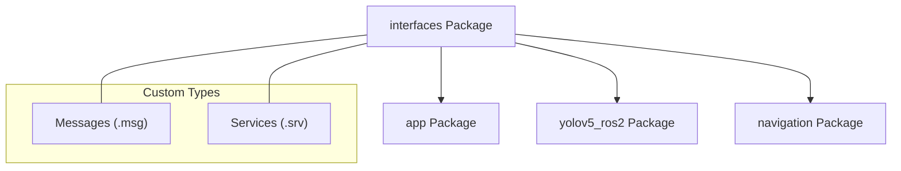

# System Overview - Interfaces Package

The `interfaces` package is the central repository for custom communication protocols used throughout the MentorPi M1 robot robot. It defines the "language" that different nodes use to talk to each other.

## Custom Messages (`msg/`)

### 1. Perception & Detection
- **`ObjectsInfo.msg` / `ObjectInfo.msg`**: Used by YOLO and CV apps to share lists of detected objects, including:
    - `class_name`: (e.g., "person", "apple")
    - `score`: Confidence value.
    - `box`: [x1, y1, x2, y2] coordinates.
- **`ColorDetect.msg`**: Results of color-based tracking.

### 2. Robot State
- **`Pose2D.msg`**: Simplified (X, Y, Theta) pose data.
- **`LineROI.msg`**: Parameters for the Regions of Interest in line following.

## Custom Services (`srv/`)

### 1. Configuration & Calibration
- **`SetColorDetectParam.srv`**: Dynamically update LAB color thresholds.
- **`SetCircleROI.srv`**: Set detection zones for object following.
- **`SetPoint.srv` / `SetPose.srv`**: Commands to move or reset the robot to specific coordinates.

### 2. General Control
- **`SetFloat64.srv` / `SetInt64.srv`**: Generic services for adjusting gains, thresholds, or switching modes.

## Importance in the System
Centralizing interfaces prevents "circular dependencies" where Package A needs Package B, and Package B needs Package A just to use a shared message. Instead, both packages depend on `interfaces`.

## Usage in Python
```python
from interfaces.msg import ObjectInfo
from interfaces.srv import SetPoint

# Example usage:
msg = ObjectInfo()
msg.class_name = "target"
```

## Dependency Graph

