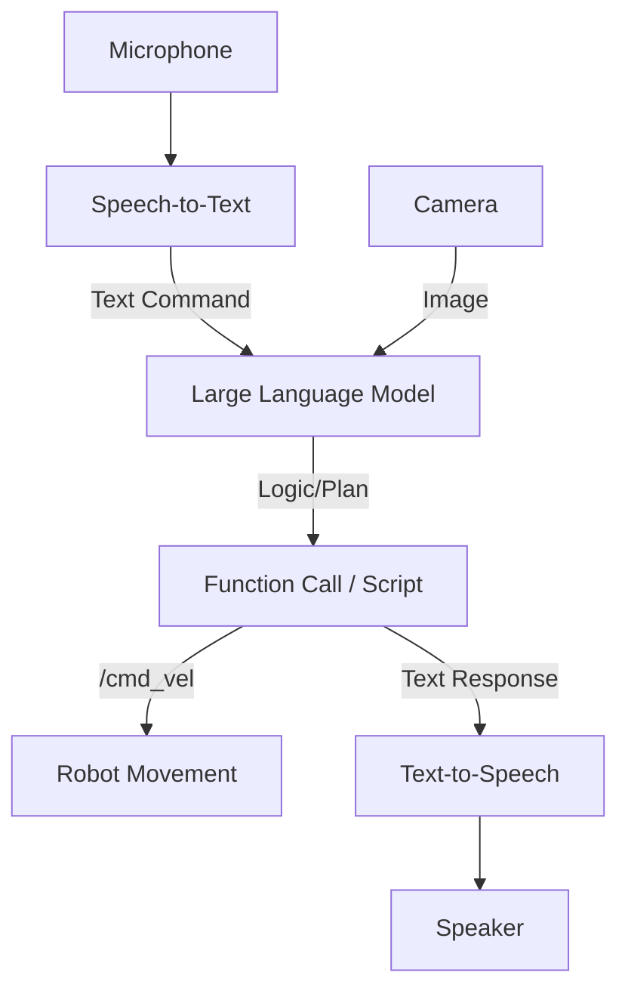

# System Overview - Large Models Package

The `large_models` package integrates state-of-the-art AI models (LLMs, VLM, TTS) into the MentorPi M1 robot robot, enabling natural language control and advanced visual reasoning.

## Core Capabilities

### 1. LLM-Based Control (`llm_control_move.py`)
Allows the robot to understand and execute complex verbal or written commands.
- **Function Calling:** Translates "Go to the kitchen and stop" into specific navigation goals and velocity commands using `function_call.py`.
- **Navigation Controller:** Interfaces with the `navigation` package to send goal poses generated by the AI.

### 2. Visual Reasoning (VLM)
Nodes like `llm_visual_patrol.py` and `vllm_with_camera.py` use Vision-Language Models to analyze camera feeds.
- **VLLM Navigation:** Robot can navigate based on visual descriptions (e.g., "Find the red chair").
- **VLLM Track:** Advanced object tracking that understands context (e.g., "Follow the person wearing a blue hat").

### 3. Speech & Audio
- **Vocal Detection (`vocal_detect.py`):** Handles wake-word detection ("Hey Mentor") and speech-to-text.
- **TTS Node (`tts_node.py`):** Text-to-Speech system allowing the robot to speak back to the user.

### 4. Advanced Tracking (`track_anything.py`)
Integrates models like SAM (Segment Anything) or specialized trackers to follow virtually any object selected via a prompt or image.

## Launch & Integration
- **`multimodal_large_models.launch.py`**: The master launcher for the AI stack.
- **`agent_process.py`**: Manages the lifecycle of AI agents and their connection to ROS 2 topics.

## AI Workflow

## Hardware Requirements
- Running these models typically requires significant compute resources. On the MentorPi M1 robot, this package often interfaces with remote cloud APIs or a local high-performance edge accelerator.
