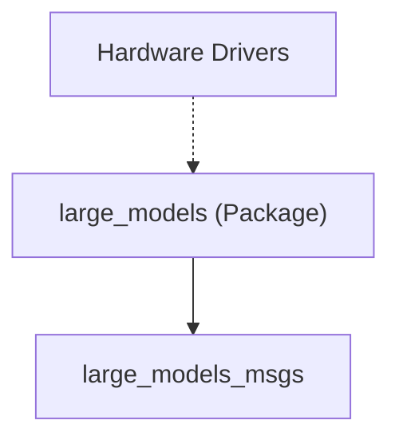

# System Overview - Large Models Msgs Package

The `large_models_msgs` package defines the custom message and service structures required specifically for the advanced AI and LLM (Large Language Model) features of the MentorPi M1 robot.

## Core Responsibilities
- **Semantic Communication:** Defines message types that carry natural language strings and semantic reasoning results.
- **AI Feedback:** Provides service definitions for getting status updates or reasoning explanations from the AI agents.
- **Standardization:** Ensures that various AI nodes (VLM, LLM, TTS) use a consistent data format, even if their underlying models or APIs change.

## Key Definitions

### Messages (`msg/`)
- **`AIState.msg`**: Tracks the current state of an AI agent (e.g., IDLE, THINKING, SPEAKING, NAVIGATING).
- **`ReasoningResult.msg`**: Used by Vision-Language Models to describe a scene or an object in detail.

### Services (`srv/`)
- **`SetString.srv`**: A common service used to send a raw text command to an AI node (e.g., setting a prompt or a goal).
- **`GetAIResponse.srv`**: Used to request a semantic answer from the robot's "brain" based on current sensor inputs.

## Role in the AI Stack
This package acts as the bridge between the low-level ROS 2 world and the high-level semantic world of AI. It allows nodes in the `large_models` package to publish findings and receive instructions in a format that is more complex than standard geometry or sensor messages.

## Dependency Graph

