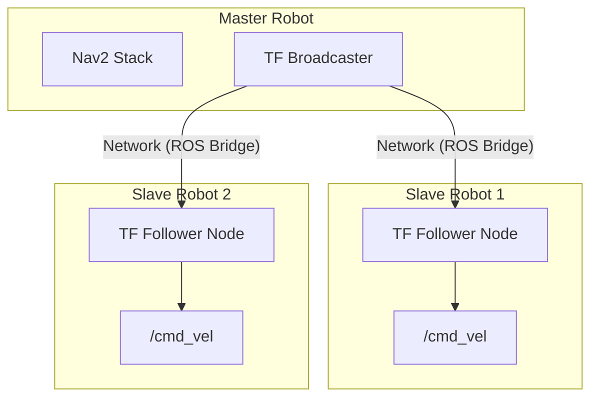

# System Overview - Multi-Robot Package

The `multi` package provides tools for coordinating multiple MentorPi M1 robot robots within a shared network, enabling formation driving and synchronized behaviors.

## Core Capabilities

### 1. Multi-Robot Coordination (`multi_controller.launch.py`)
Manages the relationship between a "Master" robot and one or more "Slave" robots.
- **TF Synchronization (`tf_listen.py` / `tf_publish.py`):** Shares coordinate transformations across the network so each robot knows where the others are.
- **Slave Tracking (`slave_tf_listener.py`):** Allows a slave robot to calculate its relative position to the master and follow it at a set offset.

### 2. Formations (`formation_update.py`)
Implements specific geometric patterns for robot groups.
- **Supported Patterns:** Line, Triangle, Diamond.
- **Logic:** The master robot broadcasts its path, and slave robots calculate their target positions based on the selected formation and maintain them using PID controllers.

### 3. Shared Mapping
Allows multiple robots to contribute to a single global map or use a shared map for localized navigation.

## Multi-Robot Architecture

## Setup Requirements
1.  **Network:** All robots must be on the same Wi-Fi subnet.
2.  **ROS_DOMAIN_ID:** Each group of robots should share the same `ROS_DOMAIN_ID`.
3.  **Time Sync:** Crucial for TF data. Robots should use NTP to synchronize their system clocks.

## How to Run
- **Master:** Start `bringup.launch.py`.
- **Slave:** Start `multi_controller.launch.py` with the master's IP/Name as an argument.
