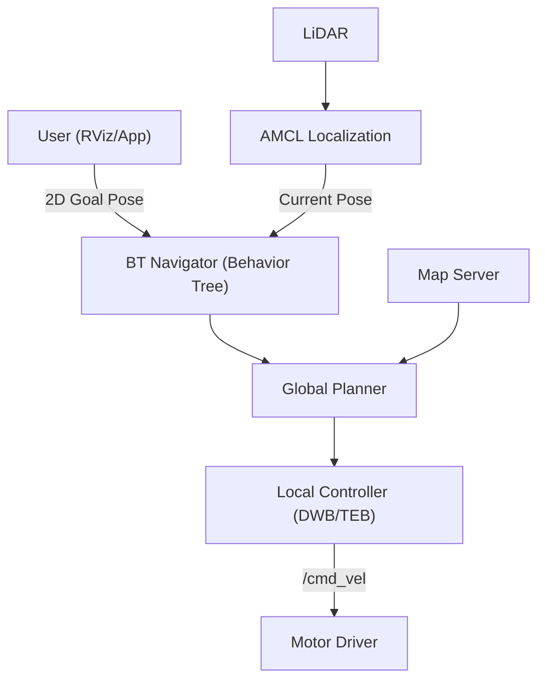

# System Overview - Navigation Package

The `navigation` package allows the MentorPi M1 robot to move autonomously through a mapped environment while avoiding obstacles.

## Core Components (Nav2 Stack)

### 1. Planner Server
Calculates the shortest path from the robot's current position to a goal on the map.
- **Global Planner:** Typically uses algorithms like NavFn or Smac Planner.

### 2. Controller Server
Translates the global path into real-time velocity commands (`cmd_vel`), ensuring the robot follows the path while avoiding moving obstacles.
- **Local Planners:** 
    - **DWB:** Reliable for most tasks.
    - **TEB (Timed Elastic Band):** Better for car-like (Ackermann) robots or tight spaces.

### 3. AMCL (Adaptive Monte Carlo Localization)
Determines exactly where the robot is on the map by comparing LiDAR scans with the saved `.pgm` map file.
- **Input:** LiDAR scans and initial pose.
- **Output:** `map` -> `odom` transform.

## Launch & Configuration

### `navigation.launch.py`
The primary launch script for autonomous movement.
- **Arguments:**
    - `map`: Path to the `.yaml` map file.
    - `use_teb`: Boolean to toggle the TEB local planner.
    - `robot_name`: Used for namespacing in multi-robot setups.

### Costmaps
- **Global Costmap:** Used for long-range planning (based on the saved map).
- **Local Costmap:** Used for short-range avoidance (based on real-time LiDAR scans). It creates "inflation" zones around obstacles to keep the robot at a safe distance.

## Navigation Workflow

## How to Navigate
1.  **Launch:** Run `navigation.sh` or the launch file.
2.  **Initial Pose:** Use the "2D Pose Estimate" button in RViz to tell the robot its starting location.
3.  **Set Goal:** Use the "2D Nav Goal" button to pick a destination.
4.  **Monitor:** Watch the global (blue) and local (red) paths in RViz.
