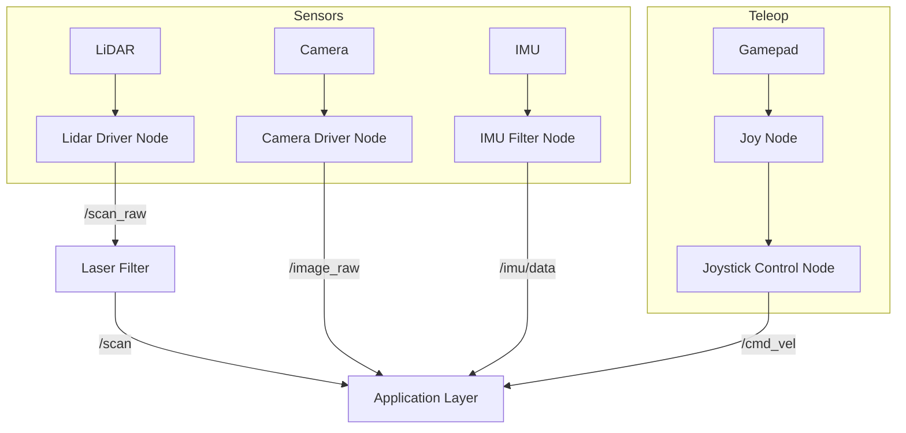

# System Overview - Peripherals Package

The `peripherals` package handles the robot's external sensors (LiDAR, Camera, IMU) and manual control devices (Joystick, Keyboard).

## Sensor Drivers

### 1. LiDAR Drivers (`lidar.launch.py`)
Provides a unified interface for multiple LiDAR models.
- **Supported Models:** MS200, LD19, LD14P, YDLidar G4, SLAMTEC A1.
- **Environment Variable:** `LIDAR_TYPE` determines which driver is launched.
- **Laser Filtering:** Applies `laser_filters` (e.g., `ScanShadowsFilter`, `InterpolationFilter`) to clean raw data, removing phantom readings from the robot's own structure.

### 2. Camera Drivers
- **Depth Camera (`depth_camera.launch.py`):** Launches Orbbec Astra or similar 3D cameras. Published to `/depth_cam`.
- **USB Camera (`usb_cam.launch.py`):** Launches standard V4L2 cameras. Published to `/usb_cam`.

### 3. IMU Processing (`imu_filter.launch.py`)
Processes raw data from the onboard MPU6050 or similar IMU.
- **Node:** `imu_filter_madgwick` or `complementary_filter`.
- **Output:** `/imu/data` (filtered orientation).
- **TF Broadcaster:** `tf_broadcaster_imu.py` links the IMU data to the robot's coordinate tree.

## Manual Control (Teleop)

### 1. Joystick Control (`joystick_control.py`)
Allows control via a physical USB/Bluetooth gamepad (PS4, Xbox, Logitech).
- **Mapping:**
    - **Left Stick:** Linear X (forward/back) and Y (sideways for Mecanum).
    - **Right Stick:** Angular Z (rotation).
    - **Buttons:** Trigger buzzer, reset position, or control servos.
- **Subscribed Topics:** `/joy` (sensor_msgs/Joy).
- **Published Topics:** `/controller/cmd_vel`.

### 2. Keyboard Control (`teleop_key_control.py`)
Standard terminal-based control using WASD keys.

## Udev Rules (`scripts/`)
Contains shell scripts (`create_udev_rules.sh`) to create symbolic links for hardware devices, ensuring consistent naming (e.g., `/dev/lidar`, `/dev/ring_mic`) regardless of which USB port is used.

## Peripheral Architecture

