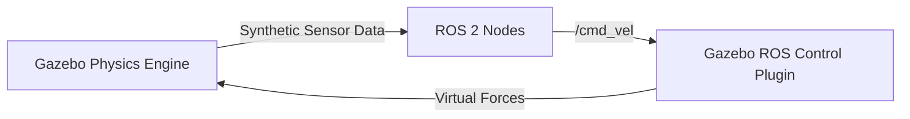

# System Overview - Simulation Package

The `simulations` package allows you to test the MentorPi M1 robot software stack in a virtual environment (Gazebo) without needing the physical robot.

## Robot Models (URDF/Xacro)

The `mentorpi_description` sub-package contains the physical definition of the robot.
- **`mentorpi.xacro`**: The master description file that combines geometry, inertia, and visual properties.
- **Chassis Variants:**
    - `mecanum.xacro`: Defines the 4-wheel holonomic base.
    - `ack.xacro`: Defines the Ackermann (car-like) steering base.
- **Sensor Plugins:**
    - `lidar.urdf.xacro`: Simulates a 2D LiDAR sensor.
    - `imu.urdf.xacro`: Simulates an Inertial Measurement Unit.

## Features
- **Physics Simulation:** Test how the robot handles slopes, friction, and collisions.
- **Sensor Simulation:** Generate synthetic `/scan` and `/image_raw` data for SLAM and CV algorithms.
- **Algorithm Validation:** Perfect for debugging navigation parameters before deploying to the real hardware.

## How to Launch
1.  **Select Chassis:** Set the `MACHINE_TYPE` environment variable.
2.  **Launch Gazebo:** Use a command like `ros2 launch simulations gazebo.launch.py`.
3.  **Visualization:** Open RViz2 to see the robot's sensor data in the virtual world.

## Simulation Architecture

