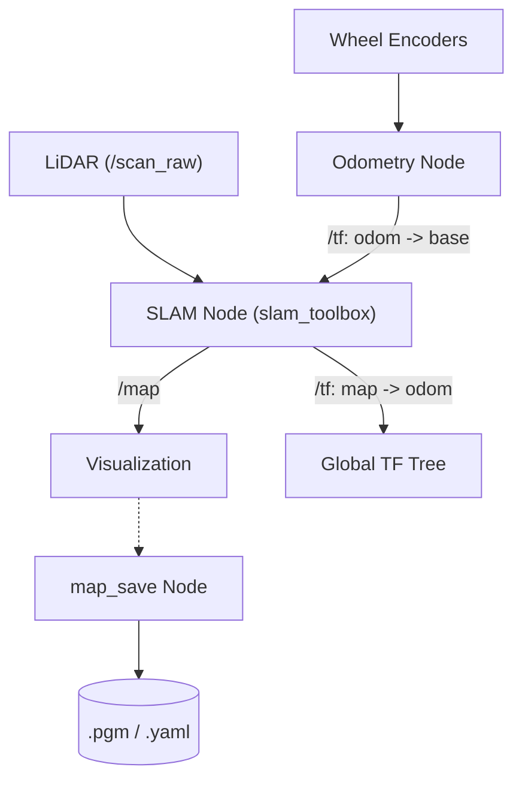

# System Overview - SLAM Package

The `slam` package enables the MentorPi M1 robot to build maps of unknown environments using its LiDAR and camera sensors.

## SLAM Methods Supported

### 1. 2D SLAM (`slam_toolbox`)
The default and most robust method for 2D mapping.
- **Node:** `slam_toolbox` (Asynchronous/Synchronous).
- **Core Input:** `/scan_raw` (sensor_msgs/LaserScan).
- **Key Features:** Supports map saving/loading, loop closure, and multi-session mapping.

### 2. Visual SLAM (`rtabmap_ros`)
Uses the depth camera to create 3D point clouds and 2D occupancy grids.
- **Node:** `rtabmap`
- **Inputs:** Depth images, RGB images, and LiDAR scans.
- **Advantages:** Provides much more detail than 2D SLAM, allowing the robot to recognize specific locations visually.

## Map Management

### Saving Maps (`map_save.py`)
Maps generated during a SLAM session must be saved to be used later for navigation.
- **Output Files:**
    - `.pgm`: The occupancy grid image (black pixels are obstacles, white are free space).
    - `.yaml`: Metadata about the map (resolution, origin, file path).
- **Command:** Usually triggered via a ROS 2 service or a dedicated desktop script (`slam.sh`).

## Launch Configuration

### `slam.launch.py`
The main orchestrator for mapping.
- **Arguments:**
    - `slam_method`: Choose between `slam_toolbox`, `gmapping`, or `cartographer`.
    - `sim`: Set to `true` if running in a Gazebo simulation.
- **Tasks:** Initializes the robot URDF, sensor transforms (`static_transform_publisher`), and the SLAM node.

## Coordinate Frames
- **`map`**: The world-fixed coordinate system.
- **`odom`**: The odometry-fixed coordinate system (drifts over time).
- **`base_footprint`**: The robot's current position on the floor.
- **SLAM Goal:** Maintain the `map` -> `odom` transform to correct odometry drift.

## SLAM Architecture

