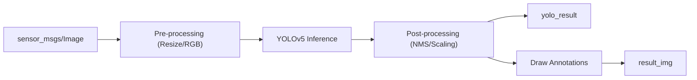

# System Overview - YOLOv5 ROS 2 Package

The `yolov5_ros2` package provides deep-learning based object detection for the MentorPi M1 robot, optimized for edge computing.

## Core Capabilities

### 1. Object Detection (`yolo_detect.py`)
Runs the YOLOv5 model to identify and locate objects in the camera feed.
- **Model Support:** Compatible with `.pt` (PyTorch) models. Default models include `yolov5s.pt` (small/fast) and specific models for traffic signs or garbage classification.
- **Device Support:** Can run on `cpu` or `cuda` (if a GPU is available).
- **Inference Results:**
    - **Bounding Boxes:** X, Y coordinates and width/height of the detected object.
    - **Class Labels:** The name of the detected object (e.g., "person", "stop sign").
    - **Confidence Scores:** A probability (0.0 to 1.0) of the detection's accuracy.

### 2. Integration Features
- **Coordinate Transformation:** The `cv_tool.py` script provides utilities to map pixel coordinates to real-world normalized coordinates.
- **FPS Monitoring:** Real-time frames-per-second (FPS) calculation to monitor system performance.
- **Annotated Feeds:** Optional publication of a video stream with bounding boxes and labels drawn on top.

## Technical Details

### Subscribed Topics
- `/ascamera/camera_publisher/rgb0/image` (sensor_msgs/Image): Input camera stream.

### Published Topics
- `yolo_result` (vision_msgs/Detection2DArray): Standard ROS 2 vision messages for integration with other tools.
- `~/object_detect` (interfaces/ObjectsInfo): Simplified custom message containing object lists.
- `result_img` (sensor_msgs/Image): (Optional) Annotated image feed.

### Services
- `/yolov5/start` (std_srvs/Trigger): Enable detection.
- `/yolov5/stop` (std_srvs/Trigger): Disable detection to save CPU/GPU resources.

## Detection Pipeline

## Performance Tips
- Use **YOLOv5n** (nano) or **YOLOv5s** (small) for the best balance of speed and accuracy on the robot's hardware.
- Disable `pub_result_img` if you only need the raw detection data to reduce network bandwidth.
- Use the `cuda` device if the hardware supports it to significantly increase FPS.
